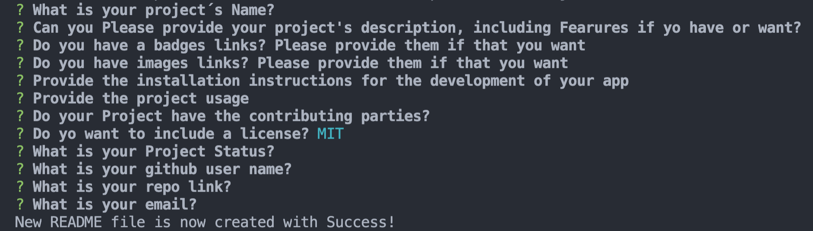

# **Good README Generator**
***
A simple ReadMe Generator for your  project repositorys

## Description 
This is a simple app that will make your life easier, just by helping you create a Good README file,for the description of your repository’s projects 


## Table of contents
- [Description](#Description)
- [Installation](#Installation)
- [How it looks](#Visuals)
- [Usage](#Usage)
- [Licence](#Licence)
- [Contributors](#Contributors)
- [Test](#Test)
- [Repository Link](#Repository)
- [GitHub Info](#GitHub) 


## Visuals 
  
  
## Installation
_To install necessary dependencies, you should run the following command:_
  > npm install then you should run the application in node, using the [Inquirer package](https://www.npmjs.com/package/inquirer).
  The application will be invoked by using the following command:

```bash
node index.js
```
 And then respond all the questions that prompts to you, in order to generate the new file.

 ## Instructions

 ```md
GIVEN a command-line application that accepts user input
WHEN I am prompted for information about my application repository
THEN a high-quality, professional README.md is generated with the title of my project and sections entitled Description, Table of Contents, Installation, Usage, License, Contributing, Tests, and Questions
WHEN I enter my project title
THEN this is displayed as the title of the README
WHEN I enter a description, installation instructions, usage information, contribution guidelines, and test instructions
THEN this information is added to the sections of the README entitled Description, Installation, Usage, Contributing, and Tests
WHEN I choose a license for my application from a list of options
THEN a badge for that license is added near the top of the README and a notice is added to the section of the README entitled License that explains which license the application is covered under
WHEN I enter my GitHub username
THEN this is added to the section of the README entitled Questions, with a link to my GitHub profile
WHEN I enter my email address
THEN this is added to the section of the README entitled Questions, with instructions on how to reach me with additional questions
WHEN I click on the links in the Table of Contents
THEN I am taken to the corresponding section of the README
```
  

## Usage
```md
AS A developer
I WANT a README generator
SO THAT I can quickly create a professional README for a new project
```

## Contributors
Just AlheliMi

## Licence
MIT

## Status
 The status of the porject at the moment:
Finished

---


## Repository
- [Project Repo](https://github.com/AlheliMi/ReadMe_Generator.git)

## Questios, Coments, Sugestions
If you have any questios about the repo, you can open an issue or contact directly to me at alhealhe72@hotmail.com. Or at gitHub AlheliMi.